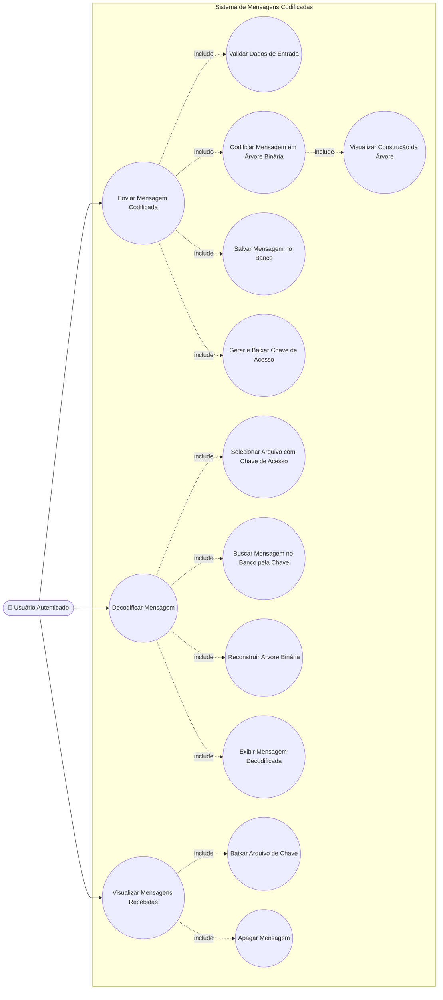

# Sistema de Mensagens Codificadas

Aplicação web para troca de mensagens entre usuários, em que cada mensagem é codificada usando uma **árvore binária construída a partir dos próprios caracteres do texto** (semelhante ao princípio de uma árvore de Huffman simplificada). A mensagem codificada fica armazenada no banco de dados, e o destinatário recebe apenas um arquivo `.txt` contendo uma **chave de acesso**, usada para buscar a mensagem no banco e decodificá-la.

## Funcionalidades

### 📤 Enviar mensagem
- Usuário autenticado seleciona um destinatário, escreve assunto e mensagem (mínimo de 10 caracteres).
- O sistema monta uma árvore binária em pós-ordem a partir dos caracteres da mensagem, com uma **animação visual** mostrando a construção passo a passo.
- Cada caractere recebe um código binário correspondente ao caminho até seu nó na árvore.
- A mensagem codificada e a árvore serializada são enviadas ao servidor (`POST /api/mensagens`), que **salva o conteúdo no banco de dados** e retorna uma **chave de acesso** única.
- Essa chave de acesso é disponibilizada para download local em um arquivo `.txt`.

### 📥 Decodificar mensagem
- Usuário autenticado faz upload do arquivo `.txt` recebido, contendo a chave de acesso.
- O sistema usa a chave para **buscar a mensagem codificada e a árvore no banco de dados** (`GET /api/mensagens/:chave`).
- A árvore binária é reconstruída a partir dos dados retornados pelo banco.
- Cada código é percorrido na árvore (`0` = esquerda, `1` = direita) até encontrar o caractere original.
- A mensagem decodificada é exibida na tela (ou uma mensagem de erro, caso a chave seja inválida, não encontrada ou o usuário não tenha permissão de acesso).

### 📬 Gerenciar mensagens recebidas
- Lista as mensagens do usuário logado (`GET /api/mensagens?usuario=...`).
- Permite **baixar** o arquivo `.txt` com a chave de acesso de uma mensagem (com verificação de que o usuário é o destinatário legítimo).
- Permite **apagar** uma mensagem (`DELETE /api/mensagens`, com confirmação do usuário) — a exclusão remove o registro do banco, invalidando a chave de acesso correspondente.

## Autenticação

O acesso é controlado via `localStorage.getItem("usuarioLogado")`. Todas as telas verificam essa chave ao carregar; se o usuário não estiver autenticado, é redirecionado para `index.html`.

## Diagrama de Caso de Uso

> "Verificar Login" é uma pré-condição incluída em cada caso de uso principal, e não uma ação separada escolhida pelo usuário.

## Estrutura do código

| Camada | Responsabilidade |
|---|---|
| `class No` | Representa um nó da árvore binária (valor, filhos esquerda/direita, índice) |
| `class Arvore` | Constrói (`construirPosOrdem`), carrega (`carregar`), codifica (`codigoDoIndice`/`codigo`) e decodifica (`encontrar`) a árvore |
| Tela de envio | Formulário, validação, construção animada da árvore, envio da mensagem codificada ao banco e geração do arquivo `.txt` com a chave de acesso |
| Tela de decodificação | Upload do arquivo `.txt` com a chave, busca da mensagem no banco, reconstrução da árvore, decodificação e exibição do resultado |
| Tela de mensagens | Listagem, download da chave de acesso e exclusão de mensagens do usuário |

## API esperada pelo backend

| Método | Rota | Descrição |
|---|---|---|
| `POST` | `/api/mensagens` | Salva a mensagem codificada e a árvore no banco (remetente, destinatário, assunto, conteúdo codificado, árvore serializada) e retorna a chave de acesso gerada |
| `GET` | `/api/mensagens?usuario=...` | Lista as mensagens de um usuário |
| `GET` | `/api/mensagens/:chave` | Busca no banco a mensagem codificada e a árvore correspondentes à chave de acesso (validando se o usuário é o destinatário legítimo) |
| `DELETE` | `/api/mensagens` | Remove uma mensagem pelo `id` (validando o usuário), invalidando a chave de acesso associada |

## Como executar

1. Sirva os arquivos HTML/JS estaticamente (ex.: `Live Server`, `http-server` ou similar).
2. Certifique-se de que uma API compatível com as rotas acima esteja disponível em `/api/mensagens`, incluindo persistência em banco de dados e geração/consulta de chaves de acesso.
3. Faça login (fora do escopo destes arquivos) para popular `localStorage.usuarioLogado`.
4. Acesse as telas de envio, decodificação e mensagens recebidas.
