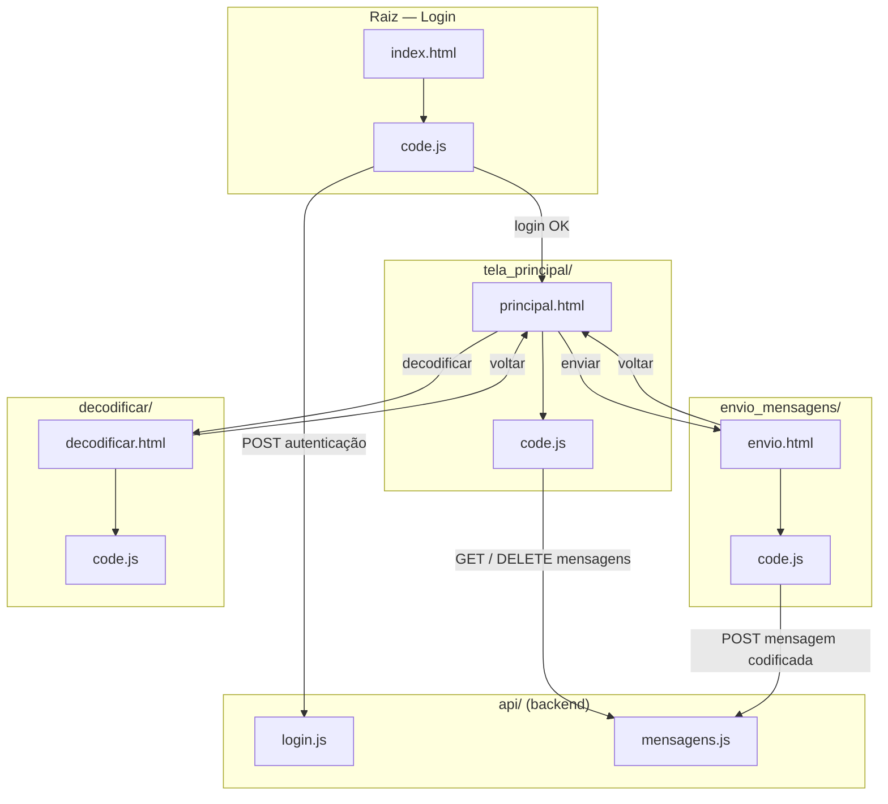

# Estrutura do Projeto — CODIFICADOR

## Árvore de diretórios

```
CODIFICADOR-MAIN/
├── api/
│   ├── login.js          # Backend: autenticação
│   └── mensagens.js      # Backend: POST/GET/DELETE de mensagens
├── decodificar/
│   ├── code.js           # Frontend: reconstrução da árvore e decodificação
│   ├── decodificar.html
│   └── style.css
├── envio_mensagens/
│   ├── code.js           # Frontend: construção da árvore, animação e envio
│   ├── envio.html
│   └── style.css
├── IMG/
│   ├── decode.png
│   ├── enviar.png
│   ├── verificar.png
│   └── voltar.png
├── tela_principal/
│   ├── code.js           # Frontend: listar, baixar e apagar mensagens
│   ├── principal.html
│   └── style.css
├── code.js                # Frontend: lógica da tela de login
├── index.html              # Tela de login (ponto de entrada)
├── package.json
└── style.css
```

## Diagrama de componentes e ligações



## Como ler as ligações

| Ligação | Significado |
|---|---|
| `HTML → code.js` (mesma pasta) | Cada tela carrega seu próprio script |
| `code.js (login) → api/login.js` | Tela de login autentica contra o backend, gravando `usuarioLogado` no `localStorage` em caso de sucesso |
| `code.js (envio) → api/mensagens.js` | Envio salva a mensagem codificada no servidor (`POST`) |
| `code.js (principal) → api/mensagens.js` | Tela principal lista (`GET`), baixa e apaga (`DELETE`) mensagens |
| `decodificar/code.js` | **Não chama a API** — decodifica localmente a partir do arquivo `.txt` que o usuário faz upload |
| Setas entre HTMLs | Navegação via botões (ícones em `IMG/`: `enviar.png`, `decode.png`, `verificar.png`, `voltar.png`) |

## Observações

